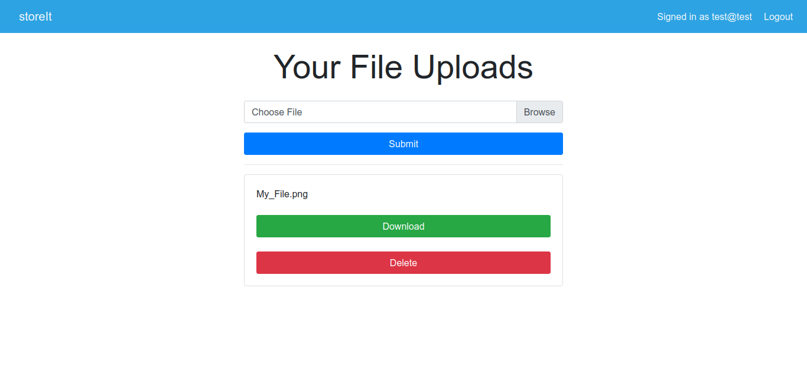

# StoreIt Cloud Storage

StoreIt is a web application that allows users to store their files on the cloud.

It is built using **NodeJS** on the back-end and simple **HTML and CSS** on the front-end.

## How It Works

Click on the **Sign Up** button to create an account (or **Login**, if you already have one).

<ins>_Landing Page_</ins>

Create your account on the **Register** page and click Sign Up. You'll be taken to the page where you can upload your files.

<ins>_Register_</ins>

<ins>_Login_</ins>

<ins>_Upload Page_</ins>

Select any file and click on **Submit**

Voila! You have successfully uploaded the file to the cloud 😄

<ins>_Upload Page With Files_</ins>

You can download or delete it any time you want.

## Run Locally

To run the project locally, ensure that you have `node` and `mongo` installed on your system, then follow the below steps:

1. Clone the repo.
2. Run `npm install` in the root directory.
3. Set the credentials for the DB in `index.js` file.
4. Run `node index.js` in the root directory.
5. Visit `localhost:8080` in your browser.

Thats it! 😊😊
